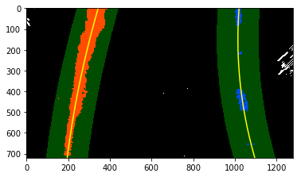

# Advanced Lane Finding

## Goal
Write a software pipeline to identify the lane boundaries in a video from a front-facing camera on a car. Rubric points (https://review.udacity.com/#!/rubrics/571/view) are also covered in this ipython notebook.

The goals / steps of this project are the following:

* Compute the camera calibration matrix and distortion coefficients given a set of chessboard images.
* Apply a distortion correction to raw images.
* Use color transforms, gradients, etc., to create a thresholded binary image.
* Apply a perspective transform to rectify binary image ("birds-eye view").
* Detect lane pixels and fit to find the lane boundary.
* Determine the curvature of the lane and vehicle position with respect to center.
* Warp the detected lane boundaries back onto the original image.
* Output visual display of the lane boundaries and numerical estimation of lane curvature and vehicle position.

## [Rubric](https://review.udacity.com/#!/rubrics/571/view) Points

### Here I will consider the rubric points individually and describe how I addressed each point in my implementation. 

### Writeup / README

#### 1. Provide a Writeup / README that includes all the rubric points and how you addressed each one.  You can submit your writeup as markdown or pdf.  [Here](https://github.com/udacity/CarND-Advanced-Lane-Lines/blob/master/writeup_template.md) is a template writeup for this project you can use as a guide and a starting point.  

You're reading it!

### Camera Calibration

#### 1. Briefly state how you computed the camera matrix and distortion coefficients. Provide an example of a distortion corrected calibration image.

The code for this step is contained in the first, second code cell of the IPython notebook.

I used chessboard calibration images (of size 9x6) provided as part of project resources to compute camera matrix and distortion coefficients.
Steps involved:

        1. Every calibrated image is converted to grayscale
        2. cv2.findChessboardCorners is used to find corners.
        3. If successful, the corners are saved in imgpoints list.
        4. As we know the size of chessboard, objpoints list is easy to construct by generating sequence ((0,0,0), (1,0,0), (2,0,0), ..., (8,5,0)) for each image.
        
I then used the output objpoints and imgpoints to compute the camera calibration and distortion coefficients using the cv2.calibrateCamera() function. I applied this distortion correction to the test image using the cv2.undistort() function.


### Pipeline (single images)

#### 1. Provide an example of a distortion-corrected image.

undistort() function is code cell 2 is applied on test image. Image below depicts pre and post distortion correction:


Note the change in white car's location :)


#### 2. Describe how (and identify where in your code) you used color transforms, gradients or other methods to create a thresholded binary image. Provide an example of a binary image result.

undistort_and_threshold() function in code cell 6 applies color transformation and sobel operator to generated thresholded binary image.

As you can see in the images below "Saturation" (higher threshold) and "Hue" (lower threshold) channel of HSV image detects lane lines better than others. Also, absolute sobel threshold X method seem to identify lanes better than other thresholding methods.

Together with HSV color transform (H and S channel) and Sobel threshold X gradient, we obtain thresholded binary image.

Directional and Magnitude thresholds has very minimal to no effect on thresholded binary image.


#### 3. Describe how (and identify where in your code) you performed a perspective transform and provide an example of a transformed image.

perspective_transform() in code cell 7 does perspective transformation.

When we apply a perspective transform, we need to choose four source points. As we know that camera position is fixed and road is flat most of the times, we can do fixed perspective transformation using four hard-coded source points.

We have used getPerspectiveTransform() and warpPerspective() to compute perspective transform and apply on image using following src and dst polygons.

|  src (X, Y) |        
|------|------|       
|  170 | 720  |        
|  550 | 460  |        
|  745 | 460  |        
| 1200 | 720  |        


|  dst (X, Y) |
|------|------| 
|  320 |   0  |
|  320 | 720  |
|  960 |   0  |
|  960 | 720  |


Perspective transformation on thresolded image:


Perspective transformation on test images:


#### 4. Describe how (and identify where in your code) you identified lane-line pixels and fit their positions with a polynomial?

sliding_window_poly_fit() and polyfit_from_previous() in ipython notebook identify lane-line pixels and fit their positions with a polynomial.

Histogram peaks of bottom half of the binary thresholded image is used to find base of left and right line (check image in the cell below the code). Then I used a sliding window, placed around the line centers, to find and follow the lines up to the top of the frame to identify lane-line pixels and then fit a 2 degree polynomial. 




The green shaded area in the above image shows where we searched for the lines. So, once we know where the lines are in one frame of video, you can do a highly targeted search for them in the next frame. This is equivalent to using a customized region of interest for each frame of video, and should help us track the lanes through sharp curves and tricky conditions. If we lose track of the lines, we go back to your sliding windows search or other method to rediscover them.


### Finding Radius of Curvature

### Rubric point 6

#### Describe how (and identify where in your code) you calculated the radius of curvature of the lane and the position of the vehicle with respect to center.

    1. I used https://www.intmath.com/applications-differentiation/8-radius-curvature.php for estimating radius of curvature.
    2. Difference in car's position (center of the image) and center of left, right lane lines is used for estimating car's offset from center. 


```python
def curvature(width, ploty, left_fitx, right_fitx):
    # Compute curve radius    
    # Define conversions in x and y from pixels space to meters
    ym_per_pix = 30/720 # meters per pixel in y dimension
    xm_per_pix = 3.7/700 # meters per pixel in x dimension

    # Choose the maximum y-value, corresponding to the bottom of the image
    y_eval = np.max(ploty)
    
    # Fit new polynomials to x,y in world space
    left_fit_cr = np.polyfit(ploty*ym_per_pix, left_fitx*xm_per_pix, 2)
    right_fit_cr = np.polyfit(ploty*ym_per_pix, right_fitx*xm_per_pix, 2)

    # Calculate the radii of curvature
    left_curverad =  ((1 + (2*left_fit_cr[0] *y_eval*ym_per_pix + left_fit_cr[1])**2) **1.5)/np.absolute(2*left_fit_cr[0])
    right_curverad = ((1 + (2*right_fit_cr[0]*y_eval*ym_per_pix + right_fit_cr[1])**2)**1.5)/np.absolute(2*right_fit_cr[0])

    # Compute car's offset from center
    car_pos = width / 2
    lane_center = (left_fitx[0] + right_fitx[0]) / 2

    vehicle_offset = (lane_center-car_pos)*xm_per_pix
    
    # Now our radius of curvature is in meters
    radius_of_curvature = np.mean([left_curverad, right_curverad])
    return radius_of_curvature, vehicle_offset
```

### Rubric point 7

#### Provide an example image of your result plotted back down onto the road such that the lane area is identified clearly.


```python
def draw_lane_area(undist, warped, Minv, left_fit, right_fit, show_curve_data=True):
    # Create an image to draw the lines on
    warp_zero = np.zeros_like(warped).astype(np.uint8)
    color_warp = np.dstack((warp_zero, warp_zero, warp_zero))

    # Generate x and y values for plotting
    ploty, left_fitx, right_fitx = generate_xy_for_plotting(warped.shape[0], left_fit, right_fit)
    
    # Recast the x and y points into usable format for cv2.fillPoly()
    pts_left = np.array([np.transpose(np.vstack([left_fitx, ploty]))])
    pts_right = np.array([np.flipud(np.transpose(np.vstack([right_fitx, ploty])))])
    pts = np.hstack((pts_left, pts_right))

    # Draw the lane onto the warped blank image
    cv2.fillPoly(color_warp, np.int_([pts]), (0,255, 0))

    # Warp the blank back to original image space using inverse perspective matrix (Minv)
    newwarp = cv2.warpPerspective(color_warp, Minv, (warped.shape[1], warped.shape[0])) 
    # Combine the result with the original image
    result = cv2.addWeighted(undist, 1, newwarp, 0.3, 0)
    if show_curve_data:
        font = cv2.FONT_HERSHEY_COMPLEX
        radius_of_curvature, vehicle_offset = curvature(warped.shape[1], ploty, left_fitx, right_fitx)
        cv2.putText(result, "Lane Curve Radius(m): {0:0.2f}".format(radius_of_curvature),
                    (20,70), font, 2,(255,255,0),2, cv2.LINE_AA)
        cv2.putText(result, "Car offset(m): {0:0.2f}".format(vehicle_offset),
                    (20,130), font, 2,(255,255,0),2, cv2.LINE_AA)
    return result, left_fit, right_fit


# Helper function to do all these steps:
# 1. Distortion correction
# 2. Color/gradient threshold
# 3. Perspective transform
# 4. Detect lane lines
# 5. Determine the lane curvature and draw lane area.
def process_image(image, left_fit_prev=None, right_fit_prev=None):
    warped, _, Minv, _ = perspective_transform(undistort_and_threshold(image))
    left_fit, right_fit = polyfit_from_previous(warped, left_fit_prev, right_fit_prev)
    if left_fit is None or right_fit is None:
        left_fit, right_fit = sliding_window_poly_fit(warped, visualize=False)
    if left_fit is not None and right_fit is not None:
        return draw_lane_area(image, warped, Minv, left_fit, right_fit)
    return image, left_fit, right_fit
```


```python
img = mpimg.imread('test_images/test6.jpg')
result,_,_ = process_image(img)
plt.imshow(result)
plt.show()
```


### Pipeline (video)

### Rubric point 8
#### Provide a link to your final video output. Your pipeline should perform reasonably well on the entire project video (wobbly lines are ok but no catastrophic failures that would cause the car to drive off the road!).

https://youtu.be/ER6T27KdeEE


```python
from moviepy.editor import VideoFileClip

class Lanes():
    def __init__(self):
        self.left_fit = None
        self.right_fit = None

def process_video(input_path, output_path):
    """
    Process input video frame by frame to draw lane area with curvature, vehicle offset information to generate
    output video.
    """
    # Read video.
    video = VideoFileClip(input_path)
    lanes = Lanes()
    # Save left_fit, right_fit from previous processed frame.
    def process(image):
        output, left_fit, right_fit = process_image(image, lanes.left_fit, lanes.right_fit)
        lanes.left_fit = left_fit
        lanes.right_fit = right_fit
        return output

    clip = video.fl_image(process)
    clip.write_videofile(output_path, audio=False)

# video
process_video('project_video.mp4', 'output.mp4')
#process_video('challenge_video.mp4', 'challenge_output.mp4')
#process_video('harder_challenge_video.mp4', 'harder_challenge_output.mp4')
```

    [MoviePy] >>>> Building video harder_challenge_output.mp4
    [MoviePy] Writing video harder_challenge_output.mp4


    100%|█████████▉| 1199/1200 [02:05<00:00,  9.36it/s]


    [MoviePy] Done.
    [MoviePy] >>>> Video ready: harder_challenge_output.mp4 
    


### Discussion
### Rubric point 9

#### Briefly discuss any problems / issues you faced in your implementation of this project. Where will your pipeline likely fail? What could you do to make it more robust?
Most time consuming part of the pipeline is thresholding an image. Figuring out right combination of channels (in image) and sobel operators to discard unnecessary pixels which are not part of lane lines was challenging. 

As you can see in 'challenge_output.mp4' (generated from challenge_video.mp4), my pipeline failed to identify lane lines because the lane is damaged slightly (with a line in the middle). My implementation assumes that there will be only two lines in the warped image. In the challenge video, thresolded warped image will have three 3 lines. Histogram peak method i used to find base of left and right lines will not work because of new line in the middle.

There are many ways to solve this issue. I will mention one simple method that can be used to solve this issue: 
1. Find the base of the line in the middle and traverse up to find the lane and discard all the pixels near that polyfit lane
2. Run the orginal histogram peak method to identify lanes.
